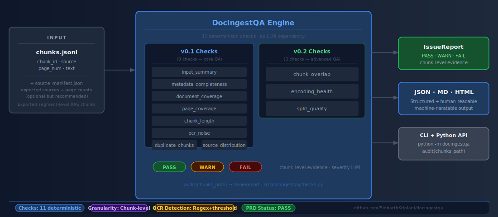
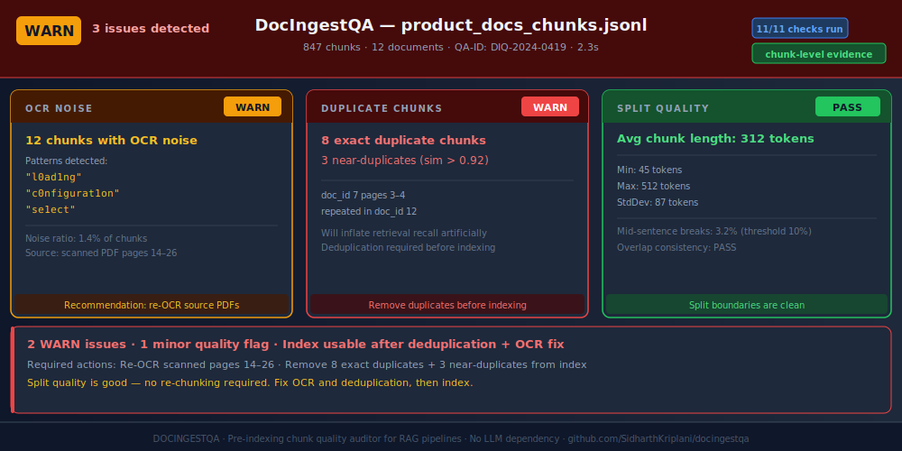
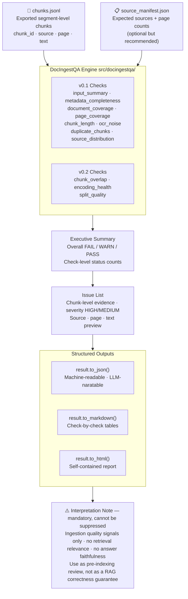

# DocIngestQA

**Pre-indexing QA auditor for RAG document ingestion pipelines.**

DocIngestQA answers a question every RAG team must ask before indexing: *are these chunks actually good enough to retrieve from?* It runs 11 deterministic checks on your exported chunks — missing pages, OCR noise, duplicates, encoding corruption, poor split boundaries, and more — and produces a structured JSON/Markdown/HTML report with issue-level evidence.

[](https://pypi.org/project/docingestqa/)
[](https://pypi.org/project/docingestqa/)
[](LICENSE)

[](src/docingestqa/checks.py)
[](tests/)
[](src/docingestqa/report.py)
[](src/docingestqa/__main__.py)
[](https://pypi.org/project/docingestqa/)

## Architecture



---

## Sample Output



---

## How it works



---

## Why DocIngestQA exists

RAG pipelines fail silently at ingestion. Missing pages, OCR garble, duplicate chunks, and mojibake encoding errors all make it into the vector database undetected — then show up as hallucinations or missed retrievals in production. By the time you trace the error back to a bad chunk, you have already shipped the issue.

DocIngestQA moves that quality gate to before indexing, where it is cheap to fix.

---

## Install

```bash
pip install docingestqa
```

For local development:

```bash
git clone https://github.com/sidharthkriplani/docingestqa
cd docingestqa
pip install -e ".[dev]"
python examples/generate_demo_data.py     # creates examples/assets/
python examples/audit_demo.py             # writes outputs/ingestion_audit.*
```

---

## Quick start

```python
from docingestqa import AuditConfig, IngestionAuditor

auditor = IngestionAuditor(
    chunks_path="chunks.jsonl",
    documents_path="source_manifest.json",   # optional
    config=AuditConfig(),
)
report = auditor.run()
report.to_json("outputs/ingestion_audit.json")
report.to_markdown("outputs/ingestion_audit.md")
report.to_html("outputs/ingestion_audit.html")

summary = report.to_dict()["executive_summary"]
print(summary["overall_status"])   # FAIL / WARN / PASS
```

### CLI

```bash
python -m docingestqa chunks.jsonl --manifest source_manifest.json --out outputs/
# exits with code 1 if overall status is FAIL
```

---

## Chunk format

DocIngestQA reads JSONL files where each line is one chunk:

```json
{"chunk_id": "abc123", "source": "annual_report.pdf", "page": 4, "text": "Revenue grew 34%..."}
```

All fields except `text` are optional but recommended. Chunks missing `source` or `page` are flagged by `metadata_completeness`. If you provide a source manifest, `document_coverage` and `page_coverage` checks also activate.

### Source manifest format

```json
[
  {"source": "annual_report.pdf", "pages": 12},
  {"source": "onboarding_guide.pdf", "pages": 8}
]
```

---

## Real output

The following is actual output from `examples/audit_demo.py` on 64 chunks across 10 synthetic documents, with deliberately seeded defects.

**Executive summary:**

```
Overall status : FAIL
Chunks audited : 64
Sources        : 10
Check counts   : PASS=4  WARN=6  FAIL=1
```

**Check results:**

| Check | Status | Summary |
|---|---|---|
| `input_summary` | PASS | 64 chunks across 10 sources |
| `metadata_completeness` | WARN | 2 chunks missing source or page metadata |
| `document_coverage` | PASS | 0 missing documents, 0 orphan sources |
| `page_coverage` | FAIL | 10 missing pages detected across 2 documents |
| `chunk_length` | WARN | 3 short chunks (possible headers/fragments) |
| `ocr_noise` | WARN | 2 chunks show OCR/extraction noise |
| `duplicate_chunks` | WARN | 1 exact duplicate chunk pair |
| `source_distribution` | PASS | 10 sources, largest at 14.1% |
| `chunk_overlap` | PASS | 1 high-overlap consecutive pair (below threshold) |
| `encoding_health` | WARN | 2 chunks contain mojibake sequences |
| `split_quality` | WARN | 4 chunks with poor split boundaries |

**Interpretation note (always included in every output):**

> DocIngestQA reports deterministic ingestion quality signals for already-generated chunks.
> It does not parse documents, evaluate retrieval relevance, verify answer faithfulness, or
> prove that a RAG system is correct. Use these outputs as pre-indexing review signals before
> loading chunks into a vector database.

---

## The 11 checks

### v0.1 checks

| Check | What it detects | Status triggers |
|---|---|---|
| `input_summary` | Empty chunk sets | FAIL if no chunks |
| `metadata_completeness` | Missing `source` or `page` | FAIL >20%, WARN >5% |
| `document_coverage` | Documents in manifest with no chunks; orphan sources | FAIL if missing docs |
| `page_coverage` | Pages expected by manifest but absent in chunk set | FAIL if any missing |
| `chunk_length` | Empty, very short (<80 chars), very long (>1500 chars) chunks | FAIL if >10% empty |
| `ocr_noise` | Replacement chars (U+FFFD), repeated junk runs, non-printable ratio | FAIL if >20% noisy |
| `duplicate_chunks` | Exact duplicates (SHA-1 hash) and near-duplicates (Jaccard on 5-grams) | FAIL if ≥30 pairs |
| `source_distribution` | One source dominating >80% of all chunks | WARN |

### v0.2 checks

| Check | What it detects | Status triggers |
|---|---|---|
| `chunk_overlap` | Consecutive chunks from the same source with Jaccard ≥ 0.40 on 4-grams — sliding-window splitter artifacts | FAIL if ≥15 high-overlap pairs, WARN if ≥3 flagged |
| `encoding_health` | Null bytes, BOM markers, control characters, mojibake patterns (é, ©, etc.) | FAIL if null bytes or mojibake rate ≥20% |
| `split_quality` | Mid-sentence starts, mid-sentence ends, navigation fragments (bare page numbers, TOC entries) | FAIL if ≥30% flagged |

---

## API reference

### `IngestionAuditor(chunks_path, documents_path, config)`

| Parameter | Type | Description |
|---|---|---|
| `chunks_path` | `str \| Path` | Path to JSONL chunk file |
| `documents_path` | `str \| Path \| None` | Optional path to JSON source manifest |
| `config` | `AuditConfig` | Threshold configuration (all fields have defaults) |

### `auditor.run() → IngestionAuditReport`

Returns a report with:

| Method | Returns |
|---|---|
| `.to_json(path=None)` | JSON string; writes file if path given |
| `.to_markdown(path=None)` | Markdown string; writes file if path given |
| `.to_html(path=None)` | Self-contained HTML report |
| `.to_dict()` | Full payload dict matching the JSON schema |

### Key `AuditConfig` thresholds

```python
AuditConfig(
    min_chunk_chars=80,
    max_chunk_chars=1500,
    noisy_text_ratio_threshold=0.05,
    replacement_char_threshold=3,
    ngram_size=5,
    near_duplicate_jaccard_threshold=0.85,
    warn_duplicate_pair_count=5,
    fail_duplicate_pair_count=30,
    # v0.2
    overlap_ngram_size=4,
    overlap_jaccard_warn_threshold=0.40,
    overlap_jaccard_fail_threshold=0.70,
    warn_overlap_pair_count=3,
    fail_overlap_pair_count=15,
    null_byte_fail_threshold=1,
    mojibake_warn_rate=0.05,
    mojibake_fail_rate=0.20,
    warn_bad_split_rate=0.10,
    fail_bad_split_rate=0.30,
)
```

---

## Output schema (v0.2)

```json
{
  "schema_version": "0.2",
  "metadata": { "docingestqa_version": "0.2.0", "generated_at": "...", "chunk_count": 64 },
  "executive_summary": {
    "overall_status": "FAIL",
    "chunk_count": 64,
    "check_counts": { "PASS": 4, "WARN": 6, "FAIL": 1 }
  },
  "checks": [
    {
      "check": "page_coverage",
      "status": "FAIL",
      "summary": "10 missing pages and 0 out-of-range pages detected.",
      "metrics": { "missing_page_total": 10, "extra_page_total": 0 },
      "issues": [
        {
          "check": "page_coverage",
          "severity": "HIGH",
          "message": "Document has pages missing from the chunk set.",
          "source": "onboarding_guide.pdf",
          "evidence": { "missing_pages": [4, 5], "expected_pages": 8 }
        }
      ],
      "recommendation": "Inspect parser logs for missing pages before indexing."
    }
  ],
  "interpretation_note": "DocIngestQA reports deterministic ingestion quality signals..."
}
```

---

## What DocIngestQA is not

**Not a document parser.** DocIngestQA audits chunks you already generated. It does not extract text from PDFs or other documents.

**Not a retrieval evaluator.** It does not measure whether your chunks are semantically relevant to queries. For that, use a retrieval eval framework.

**Not a RAG correctness checker.** It does not verify whether answers generated from these chunks are faithful or accurate.

**Not a statistical significance tester.** Checks are deterministic heuristics, not hypothesis tests. Issue counts are investigation priorities, not p-values.

**Not an embedding quality checker.** It works on raw text, not embeddings. Embedding quality (cluster separation, isotropy) is a separate concern.

---

## Comparison

| Capability | DocIngestQA | Manual inspection | Generic data quality |
|---|---|---|---|
| Missing page detection | Yes | No | No |
| OCR noise detection | Yes | Slow | No |
| Duplicate/near-dup chunks | Yes | No | Partial |
| Mojibake / encoding errors | Yes | Slow | No |
| Sliding-window overlap | Yes | No | No |
| Split boundary quality | Yes | Slow | No |
| Structured JSON output | Yes | No | Varies |
| Zero non-stdlib dependencies | Yes | — | No |

---

## Roadmap

| Version | Scope |
|---|---|
| **v0.1.0** | 8 checks, JSON/MD/HTML output |
| **v0.2.0** | 3 new checks (overlap, encoding, split quality), CLI, Python 3.10 compat |
| v0.3 | Configurable severity overrides, per-source report sections |
| v1.0 | Semantic coherence check (embedding cosine within chunk), LLM-narrated summary option |

---

## Resume-Safe Claim

Built **DocIngestQA**, a pre-indexing QA auditor for RAG document ingestion pipelines that runs 11 deterministic checks on exported chunk JSONL files — detecting missing pages, OCR noise, exact/near-duplicate chunks, mojibake encoding errors, sliding-window split overlap, and poor split boundaries — with a CLI, configurable thresholds, structured JSON/Markdown/HTML output, and a mandatory truth boundary note that distinguishes ingestion quality signals from retrieval relevance or RAG correctness.

---

## Contributing

See [CONTRIBUTING.md](CONTRIBUTING.md). Issues and PRs welcome.

---

## License

MIT © Sidharth Kriplani

---

## Interview Defense

[📄 DocIngestQA_Interview_Defense_v3.pdf](docs/defense/DocIngestQA_Interview_Defense_v3.pdf) — covers all 11 checks in depth, OCR noise detection methodology, split boundary heuristics, and scaling to large corpora.

---

## How This Connects

DocIngestQA is the **pre-indexing document quality gate** for RAG systems in this portfolio:

- **DevPulse:** DevPulse's 9-chunk demo corpus, and any expansion of that corpus with real documentation, passes through DocIngestQA before indexing. The 11 checks catch OCR noise (which would corrupt BM25 term statistics), missing pages (which would create retrieval blind spots), and poor split boundaries (which would fragment the context that DevPulse's conflict detector needs). DevPulse's Recall@5 = 0.97 depends on clean, well-bounded chunks.
- **Any RAG pipeline:** The auditor is document-format agnostic. Whether documents come from PDF extraction, web scraping, or manual authoring, DocIngestQA validates the exported chunk JSONL before the index is built — preventing garbage-in-garbage-out retrieval.
- **GoldenSetAuditor relationship:** DocIngestQA audits the source corpus; GoldenSetAuditor audits the evaluation set. Both must pass before a RAG system's retrieval metrics are reportable.

---

## Part of Applied LLM Systems Portfolio

This project is part of a 13-repo portfolio targeting Applied LLM Systems Engineer, MLOps, and Technical AI PM roles.

**Applied Systems (LangGraph pipelines):**

| Project | Domain | Primary Failure Mode |
|---------|--------|----------------------|
| [LendFlow](https://github.com/SidharthKriplani/lendflow) | Financial underwriting | When to stop or escalate |
| [AgentReliabilityLab](https://github.com/SidharthKriplani/agentreliabilitylab) | Cyber threat triage | When to stop or escalate |
| [NexusSupply](https://github.com/SidharthKriplani/nexussupply) | Supplier risk intelligence | Conflicting signal fusion |

**Platforms & Auditors (domain-agnostic tooling):**

| Project | What It Audits / Builds |
|---------|------------------------|
| [InferenceLens](https://github.com/SidharthKriplani/inferencelens) | Inference cost/quality tradeoffs — Pareto frontier, routing rules |
| [RiskFrame](https://github.com/SidharthKriplani/riskframe_platform) | ML model lifecycle — champion/challenger, drift, fairness |
| [MetaSignal](https://github.com/SidharthKriplani/metasignal_platform) | A/B experiment validity — CUPED, guardrail-first, SRM |
| [DevPulse](https://github.com/SidharthKriplani/devpulse_platform) | Version-safe RAG — conflict detection, LLM-Last architecture |
| [PulseRank](https://github.com/SidharthKriplani/pulserank_platform) | Marketplace ranking — IPS debiasing, MMR diversity |
| [TrialCheck](https://github.com/SidharthKriplani/trialcheck_v0) | A/B readout audit — SRM, peeking, underpowered tests |
| [FeatureLeakageLens](https://github.com/SidharthKriplani/featureleakagelens_v0) | Pre-training leakage — target, temporal, overlap |
| [GoldenSetAuditor](https://github.com/SidharthKriplani/goldensetauditor_v0) | LLM/RAG eval dataset quality |
| **DocIngestQA** | RAG document ingestion quality — 11 deterministic checks |
| [MetricLens](https://github.com/SidharthKriplani/metriclens) | Metric movement decomposition — mix shift vs rate shift |
